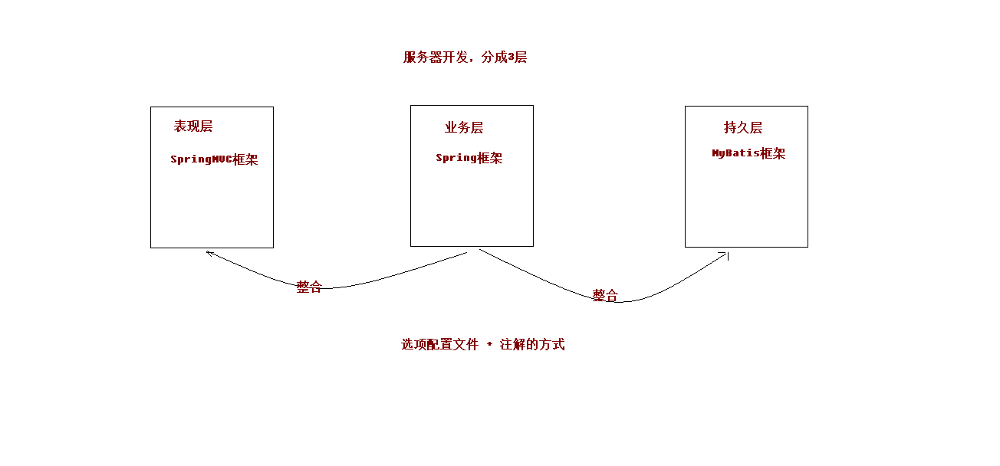

# *Spring+SpringMVC+Mybatis三大框架整合* 
## 1.创建数据库和表结构（以个人账户为例）
	create database ssm; 
	create table account(  
		id int primary key auto_increment,
	    name varchar(100),
	    money double(7,2)
 	);
<!-- more -->  
## 整合原理和目录结构图
  

----

    

## 2.创建maven项目，导入依赖坐标并编写实体类Account、业务层接口AccountService和持久层接口AccountDao  
	<properties>
	    <project.build.sourceEncoding>UTF-8</project.build.sourceEncoding>
	    <maven.compiler.source>1.8</maven.compiler.source>
	    <maven.compiler.target>1.8</maven.compiler.target>
	    <spring.version>5.0.2.RELEASE</spring.version>
	    <slf4j.version>1.6.6</slf4j.version>
	    <log4j.version>1.2.12</log4j.version>
	    <shiro.version>1.2.3</shiro.version>
	    <mysql.version>5.1.6</mysql.version>
	    <mybatis.version>3.4.5</mybatis.version>
  	</properties>  

  	<dependencies>
	    <!-- spring -->
	    <dependency>
	      	<groupId>org.aspectj</groupId>
	    	<artifactId>aspectjweaver</artifactId>
	      	<version>1.6.8</version>
	  	</dependency>
	    <dependency>
	      <groupId>org.springframework</groupId>
	      <artifactId>spring-aop</artifactId>
	      <version>${spring.version}</version>
	    </dependency>
	    <dependency>
	      <groupId>org.springframework</groupId>
	      <artifactId>spring-context</artifactId>
	      <version>${spring.version}</version>
	    </dependency>
	    <dependency>
	      <groupId>org.springframework</groupId>
	      <artifactId>spring-context-support</artifactId>
	      <version>${spring.version}</version>
	    </dependency>	
	    <dependency>
	      <groupId>org.springframework</groupId>
	      <artifactId>spring-web</artifactId>
	      <version>${spring.version}</version>
	    </dependency>
	
	    <dependency>
	      <groupId>org.springframework</groupId>
	      <artifactId>spring-orm</artifactId>
	      <version>${spring.version}</version>
	    </dependency>	
	    <dependency>
	      <groupId>org.springframework</groupId>
	      <artifactId>spring-beans</artifactId>
	      <version>${spring.version}</version>
	    </dependency>	
	    <dependency>
	      <groupId>org.springframework</groupId>
	      <artifactId>spring-core</artifactId>
	      <version>${spring.version}</version>
	    </dependency>	
	    <dependency>
	      <groupId>org.springframework</groupId>
	      <artifactId>spring-test</artifactId>
	      <version>${spring.version}</version>
	    </dependency>	
	    <dependency>
	      <groupId>org.springframework</groupId>
	      <artifactId>spring-webmvc</artifactId>
	      <version>${spring.version}</version>
	    </dependency>	
	    <dependency>
	      <groupId>org.springframework</groupId>
	      <artifactId>spring-tx</artifactId>
	      <version>${spring.version}</version>
	    </dependency>	
	    <dependency>
	      <groupId>junit</groupId>
	      <artifactId>junit</artifactId>
	      <version>4.12</version>
	      <scope>complie</scope>
	    </dependency>
	    <dependency>
	      <groupId>mysql</groupId>
	      <artifactId>mysql-connector-java</artifactId>
	      <version>${mysql.version}</version>
	    </dependency>	
	    <dependency>
	      <groupId>javax.servlet</groupId>
	      <artifactId>servlet-api</artifactId>
	      <version>2.5</version>
	      <scope>provided</scope>
	    </dependency>	
	    <dependency>
	      <groupId>javax.servlet.jsp</groupId>
	      <artifactId>jsp-api</artifactId>
	      <version>2.0</version>
	      <scope>provided</scope>
	    </dependency>	
	    <dependency>
	    <groupId>jstl</groupId>
	      <artifactId>jstl</artifactId>
	      <version>1.2</version>
	    </dependency>	
	    <!-- log start -->
	    <dependency>
	      <groupId>log4j</groupId>
	      <artifactId>log4j</artifactId>
	      <version>${log4j.version}</version>
	    </dependency>	
	    <dependency>
	      <groupId>org.slf4j</groupId>
	      <artifactId>slf4j-api</artifactId>
	      <version>${slf4j.version}</version>
	    </dependency>	
	    <dependency>
	      <groupId>org.slf4j</groupId>
	      <artifactId>slf4j-log4j12</artifactId>
	      <version>${slf4j.version}</version>
	    </dependency>
	    <!-- log end -->
	    <dependency>
	      <groupId>org.mybatis</groupId>
	      <artifactId>mybatis</artifactId>
	      <version>${mybatis.version}</version>
	    </dependency>	
	    <dependency>
	      <groupId>org.mybatis</groupId>
	      <artifactId>mybatis-spring</artifactId>
	      <version>1.3.0</version>
	    </dependency>
	    <dependency>
	      <groupId>c3p0</groupId>
	      <artifactId>c3p0</artifactId>
	      <version>0.9.1.2</version>
	      <type>jar</type>
	      <scope>compile</scope>
	    </dependency>
 	 </dependencies>  

## 3.搭建Spring环境  
### 3.1 *编写Spring配置文件applicationContext.xml*  
	<?xml version="1.0" encoding="UTF-8"?>
	<beans  xmlns="http://www.springframework.org/schema/beans"
        xmlns:xsi="http://www.w3.org/2001/XMLSchema-instance"
        xmlns:aop="http://www.springframework.org/schema/aop"
        xmlns:tx="http://www.springframework.org/schema/tx"
        xmlns:context="http://www.springframework.org/schema/context"
        xsi:schemaLocation="http://www.springframework.org/schema/beans
        http://www.springframework.org/schema/beans/spring-beans.xsd
        http://www.springframework.org/schema/tx
        http://www.springframework.org/schema/tx/spring-tx.xsd
        http://www.springframework.org/schema/aop
        http://www.springframework.org/schema/aop/spring-aop.xsd
        http://www.springframework.org/schema/context
        http://www.springframework.org/schema/context/spring-context.xsd">
    <!--开启注解扫描,只处理Service and dao ,controller不需要spring来处理-->
    <context:component-scan base-package="cn.itcast">
        <!--配置哪些注解不扫描-->
        <context:exclude-filter type="annotation" expression="org.springframework.stereotype.Controller"/>
    </context:component-scan>
	</beans>  
### 3.2 *使用注解配置业务层和持久层*  
	主要是用作测试Spring环境是否搭建成功    
## 4.搭建SpringMVC环境
### 4.1 *在web.xml文件中配置核心控制器等(DiapatcherServlet)*  
	<!DOCTYPE web-app PUBLIC
	 "-//Sun Microsystems, Inc.//DTD Web Application 2.3//EN"
	 "http://java.sun.com/dtd/web-app_2_3.dtd" >
	
	<web-app>
	  <display-name>Archetype Created Web Application</display-name>
	  <!--配置解决中文乱码的过滤器-->
	  <filter>
	    <filter-name>characterEncodingFilter</filter-name>
	    <filter-class>org.springframework.web.filter.CharacterEncodingFilter</filter-class>
	    <init-param>
	      <param-name>encoding</param-name>
	      <param-value>UTF-8</param-value>
	    </init-param>
	  </filter>
	  <filter-mapping>
	    <filter-name>characterEncodingFilter</filter-name>
	    <url-pattern>/*</url-pattern>
	  </filter-mapping>
	  
	  <!--配置前端控制器-->
	  <servlet>
	    <servlet-name>dispatcherServlet</servlet-name>
	    <servlet-class>org.springframework.web.servlet.DispatcherServlet</servlet-class>
	    <!--加载初始化文件-->
	    <init-param>
	      <param-name>contextConfigLocation</param-name>
	      <param-value>classpath*:springmvc.xml</param-value>
	    </init-param>
	    <!--启动服务器，创建该servlet-->
	    <load-on-startup>1</load-on-startup>
	  </servlet>
	  <servlet-mapping>
	    <servlet-name>dispatcherServlet</servlet-name>
	    <url-pattern>/</url-pattern>
	  </servlet-mapping>
	</web-app>
### 4.2 *编写SpringMVC的配置文件*  
	<?xml version="1.0" encoding="UTF-8"?>
	<beans xmlns="http://www.springframework.org/schema/beans"
	       xmlns:xsi="http://www.w3.org/2001/XMLSchema-instance"
	       xmlns:context="http://www.springframework.org/schema/context"
	       xmlns:mvc="http://www.springframework.org/schema/mvc"
	       xmlns:mvcc="http://www.springframework.org/schema/cache"
	       xsi:schemaLocation="http://www.springframework.org/schema/beans
	       http://www.springframework.org/schema/beans/spring-beans.xsd
	       http://www.springframework.org/schema/context
	       http://www.springframework.org/schema/context/spring-context.xsd
	       http://www.springframework.org/schema/mvc
	       http://www.springframework.org/schema/mvc/spring-mvc.xsd
	       http://www.springframework.org/schema/cache
	       http://www.springframework.org/schema/cache/spring-cache.xsd">
	    <!--开启注解扫描，只扫描controller注解-->
	    <context:component-scan base-package="cn.itcast">
	        <context:include-filter type="annotation" expression="org.springframework.stereotype.Controller"/>
	    </context:component-scan>
	
	    <!--配置视图解析器对象-->
	    <bean id="internalResourceViewResolver" class="org.springframework.web.servlet.view.InternalResourceViewResolver">
	        <property name="prefix" value="/WEB-INF/pages/"/>
	        <property name="suffix" value=".jsp"/>
	    </bean>
	
	    <!--静态资源的过滤-->
	    <mvc:resources location="/css/" mapping="/css/**"/>
	    <mvc:resources location="/js/" mapping="/js/**"/>
	    <mvc:resources location="/images/" mapping="/images/**"/>
	
	    <!--开启SpringMVC注解的支持-->
	    <mvc:annotation-driven/>
	</beans>   
## 5.Spring整合SpringMVC框架  
### 5.3 *配置监听器实现启动服务器创建容器（在web.xml配置文件中编写）*  

  

	<!--配置spring的监听器,默认只加载WEB-INF目录下的applicationContext.xml配置文件-->
	  <listener>
	    <listener-class>org.springframework.web.context.ContextLoaderListener</listener-class>
	  </listener>
  	<!--设置配置文件的路径-->
	  <context-param>
	    <param-name>contextConfigLocation</param-name>
	    <param-value>classpath:applicationContext.xml</param-value>
	  </context-param>
  
### 5.2 *编写controller和jsp页面进行测试前两个框架是否整合成功*
	整合成功的依据：在用户在页面点击查询按钮，发送请求，执行controller中的方法，如果方法中能成功的使用业务层对象调用业务层的查询方法，  
	并返回查询结果。  这说明Spring和SpringMVC整合成功。 
## 6.搭建Mybatis环境并测试   
### 6.1 *编写SqlMapConfig.xml配置文件* 
	注意：这里使用代理dao的方式来操作持久层，所以不需要dao的实现类。  
	<?xml version="1.0" encoding="UTF-8"?>
	<!DOCTYPE configuration  
	  PUBLIC "-//mybatis.org//DTD Config 3.0//EN"  
	  "http://mybatis.org/dtd/mybatis-3-config.dtd">
	<configuration>
	<!-- 配置连接数据库的信息 -->
	<properties resource="jdbcConfig.properties"></properties>
	<!-- 配置mybatis的环境 -->
	<environments default="mysql">
		<environment id="mysql">
			<!-- 配置事务管理 -->
			<transactionManager type="JDBC"></transactionManager>
			<dataSource type="pooled">
				<property name="driver" value="${jdbc.driver}"/>
				<property name="url" value="${jdbc.url}"/>
				<property name="username" value="${jdbc.username}"/>
				<property name="password" value="${jdbc.password}"/>
			</dataSource>
		</environment>
	</environments>
	
	<!-- 指定映射文件位置，因为在接口中直接使用了注解的方式编写sql语句 -->
	<mappers>
		<mapper class="com.itheima.dao.IAccountDao"/>
	</mappers>
	</configuration> 

	properties 文件中的内容： 
	jdbc.driver=com.mysql.jdbc.Driver 
	jdbc.url=jdbc:mysql://localhost:3306/ssm 
	jdbc.username=root 
	jdbc.password=root 
### 6.2 *编写测试类测试mybatis框架是否和数据库正常交互*  
## 7.Spring整合Mybatis框架
### 7.1 *整合成功的依据*  
	在service层能够成功的调用到dao层的方法并返回结果。
### 7.2 *整合思路*
	因为持久层accountDao是一个接口，我们使用的是dao的代理对象，如果能将这个代理对象放入ioc容器中，就可以在容器中拿到对象并调用方法。
### 7.3 *Spring接管Mybatis的session工厂* 
	<!--Spring整合Mybatis-->
    <!--配置连接池-->

    <bean id="dataSource" class="com.mchange.v2.c3p0.ComboPooledDataSource">
        <property name="driverClass" value="com.mysql.jdbc.Driver"/>
        <property name="jdbcUrl" value="jdbc:mysql://localhost:3306/ssm"/>
        <property name="user" value="root"/>
        <property name="password" value="221604"/>
    </bean>
    <!--配置sqlSessionFactory工厂-->
    <bean id="sqlSessionFactory" class="org.mybatis.spring.SqlSessionFactoryBean">
        <property name="dataSource" ref="dataSource"/>
    </bean>
    <!--配置AccountDao所在的包-->
    <bean id="mapperScanner" class="org.mybatis.spring.mapper.MapperScannerConfigurer">
        <property name="basePackage" value="cn.itcast.dao"/>
    </bean>  
## 8.配置事务管理  
	<!--配置Spring框架声明式事务管理-->
    <!--配置事务管理器-->
    <bean id="transactionManager" class="org.springframework.jdbc.datasource.DataSourceTransactionManager">
        <property name="dataSource" ref="dataSource"/>
    </bean>

    <!--配置事务通知-->
    <tx:advice id="txAdvice" transaction-manager="transactionManager">
        <tx:attributes>
            <tx:method name="find*" read-only="true"/>
            <tx:method name="*" isolation="DEFAULT"/>
        </tx:attributes>
    </tx:advice>

    <!--配置aop增强-->
    <aop:config>
        <aop:pointcut id="exp" expression="execution(* com.xiaoshuai885.service.impl.*.*(..))"/>
        <aop:advisor advice-ref="txAdvice" pointcut-ref="exp"/>
    </aop:config>
# ssm
# ssm
